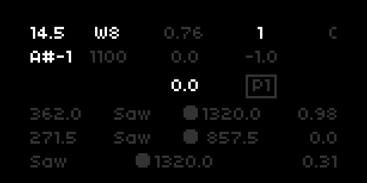

Stjörnuíþrótt<sup>[1](#_1)</sup>
---

Drone synth for [Norns](http://monome.org/norns)/[Fates](https://llllllll.co/t/fates-a-diy-norns-dac-board-for-raspberry-pi/22999) heavily inspired Moffeenzeef [Stargazer](https://www.moffenzeefmodular.com/stargazer). Much appreciation goes to [Moffeenzeef](https://www.moffenzeefmodular.com/) for creating the Stargazer and [kergener](https://sccode.org/kergener) for their [SCgazer](https://sccode.org/1-5db) Supercollider engine which serves as the backbone for this Norns version.



The hardware Stargazer has some impressive drone capabilities, which are eumlated here:

- dual wavetable oscillator with 90 arbitrary waveforms
- suboctave, detune, volume for second oscillator 
- 2 resonant filters
- sample rate reductiøn
- bit rate reduction
- 3 wavetable LFOs
- CMOS distortion with 100x gain 


## Requirements

The current implementation of param controls neccessitates the 4th encoder, which is only available on [Fates](https://llllllll.co/t/fates-a-diy-norns-dac-board-for-raspberry-pi/22999).


## Install

[SSH](https://monome.org/docs/norns/maiden/#sshhttps://monome.org/docs/norns/maiden/#ssh) into your Norns/Fates, then enter the following commands in terminal.

```bash
$ cd dust/code
$ git clone https://github.com/frederickk/stjoernuithrott.git
```

After install `RESET` or `SLEEP` is required, because Stjörnuíþrótt install a new engine.


## Params

The params for Stjörnuíþrótt are vast. As with the original Stargazer knob twiddling and experimentation are encouraged. However, here's an overview of all the controls and their values (also listed within the params menu).

Bolded params are controllable via Midi, in the future if enough interest support for Midi CC messages may be added.

| Page    | Controller                    | Descrption                                | Values                     |
| ------- | ----------------------------- | ----------------------------------------- | -------------------------- |
| **All** | **E1**<br />**Midi Note**     | **Pitch**                                 | **1 – 1320 Hz**            |
| All     | K2                            | Suboctave                                 | On or Off                  |
| **1**   | **E2**<br />**Midi Velocity** | **Volume**                                | **0.0 - 1.0**              |
| 1       | E4                            | Waveform selector                         | 0 – 89                     |
| 2       | E2                            | Detune parameter of the second oscillator | 0 – 1                      |
| 2       | E3                            | Mix for 2nd oscillator.                   | L(eft), C(enter), R(night) |
| 2       | E4                            | Gain stage for CMOS distortion            | -1 is clean, 1 is dirty    |
| 3       | E2                            | Cutoff frequency for the 1st filter       | 1 – 1320 Hz                |
| 3       | E3                            | Cutoff frequency for the 2nd filter       | 1 – 1320 Hz                |
| 4       | E4                            | LFO of 1st filter                         | Tri(angle), Saw, Pulse     |
| 4       | E2                            | LFO of 2nd filter                         | Tri(angle), Saw, Pulse     |
| 4       | E3                            | LFO of 3rd filter                         | Tri(angle), Saw, Pulse     |
| 5       | E4                            | Rate of 1st LFO                           | 1 – 1320 Hz                |
| 5       | E2                            | Rate of 2nd LFO                           | 1 – 1320 Hz                |
| 5       | E3                            | Rate of 3rd LFO                           | 1 – 1320 Hz                |
| 6       | E4                            | Depth of 1st LFO                          | 1 none, 0 max              |
| 6       | E2                            | Depth of 2nd LFO                          | 1 none, 0 max              |
| 6       | E3                            | Depth of 3rd LFO                          | 1 none, 0 max              |
| 7       | E2                            | Sample rate reduction                     | 100 – 48000 Hz             |
| 7       | E3                            | Bit rate reduction                        | 0 – 24 bits                |

---

<sup id="_1">1</sup> Stjörnuíþrótt is a crazy name huh? It's old Norse for Astronomy.